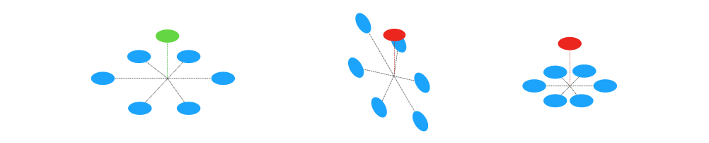
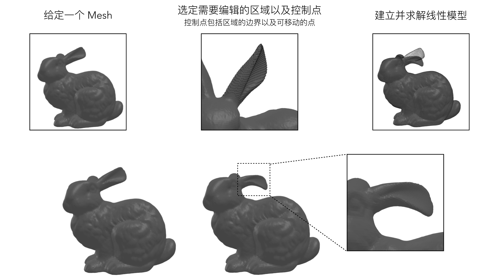

# Laplacian Surface Editing

罗世通 1600017413

[TOC]

## 问题描述

Mesh 是由一些列微小的三角形无缝拼合组成的曲面。 Mesh 也可以视为一个图（Graph），其中，三角形的顶点是图的结点（Vertex），三角形的边则是图的边（Edge）。于是，Mesh 可以由一系列顶点、顶点在空间中的位置，以及顶点之间的关系确定。

Mesh 的结点在空间中的位置可以由两种方式表示，分别是：

1. **绝对坐标**：即每个顶点在空间中的绝对位置，这种表示方式适用于场景图形渲染，优点是简单直接，缺点是坐标会随 Mesh 在空间中的绝对位置改变，无法很好地体现 Mesh 的结构，因此也称绝对坐标是外在（extrinsic）的表示；
2. **相对坐标**：将 Mesh 视为一幅图（Graph），每个顶点的位置是其邻居顶点位置的函数，这种表示方式与 Mesh 在场景中的位置无关，能够体现 Mesh 的结构，因此也称为内在（intrinsic）表示。

Laplacian surface editing 主要利用 Mesh 顶点的相对坐标，采用了以下相对坐标的定义：
$$
\delta_i = \mathscr{L}\left(\mathbf{v}_{i}\right)=\mathbf{v}_{i}-\frac{1}{d_{i}} \sum_{j \in \mathbb{N}_{i}} \mathbf{v}_{j} \ , \quad i=1, \ldots,n
$$
其中 $\mathbf{v_i}$ 是顶点 $i$ 的绝对坐标，$\delta_i$ 是相对坐标，$d_i$ 是顶点的度数，$\mathbb{N}_i$ 是其邻域。更紧凑的公式为：
$$
\Delta = (I - D^{-1}A)V
$$
其中 $A$ 是 0-1 邻接矩阵，可以发现 $(I - D^{-1} A)$ 正是谱图论中定义的 Random Walk Laplacian 矩阵。

Laplacian surface editing 要解决三种问题：

1. **Mesh Editing (Deformation)**：调整 Mesh 的整体形态，同时保证 Mesh 的细节形态尽可能保留；
2. **Coating Transfer**：将另一种 Mesh 的表面细节形态转移到一个 Mesh 的表面上，例如，让兔子拥有龙的鳞甲；
3. **Transplanting**：将两个 Mesh 嫁接在一起（例如，虎头蛇尾），要求过渡自然。

对于 Mesh Editing 问题，基本的思路是：对 Mesh 进行变形时，尽可能保证变形后顶点的相对坐标发生的变化尽可能小，甚至不发生变化；解决 Coating Transfer 问题的基本思路是让需要修改的区域的顶点具有新的相对坐标，同时尽可能保证区域边界的绝对坐标不发生变化；Transplanting 问题类似。

## 算法

Laplacian surface editing 的关键是下述线性最小二乘问题：

**[输入]**

- 变形前绝对坐标 $V$
- 相对坐标 $\Delta$ （对于 Mesh Editing 问题，$\Delta$ 就是由 $V$ 得到的相对坐标，对于 Coating Transfer 问题，$\Delta$ 是目标表面的相对坐标）
- 控制点集合 $P_\text{ControlPoints}$ 

**[求解目标]**

- 变形后绝对坐标 $V'$

**[约束条件]**

1. 为了保证 Mesh 细节符合期望，要让 $V’$ 相对坐标与输入相对坐标 $\Delta$ 尽可能一致

$$
\Delta - \mathscr{L}(V') = 0
$$

2. 要让控制点在变形后处于目标位置

$$
\mathbf{v}_{i}^{\prime}-\mathbf{u}_{i}=0 \ , \quad i \in P_{\text {ControlPoints }}
$$

**[求解算法]**

- 由于这是一个超定问题（控制点数量大于 1，其中有 1 个控制点决定 Mesh 的位置，其余控制点决定 Mesh 的形态），因此需要采用**最小二乘法**求解；
- 由于顶点度数很低（5～7度），这是一个稀疏线性问题，应该采用为稀疏问题优化的算法，可大大提高效率。

**[存在问题及修正：旋转缩放不变性]**

如下图所示，Laplacian surface editing 采用的相对坐标对旋转和缩放是不具有不变性的，如下图所示：

这意味着一旦某个结点周围发生旋转或者缩放，那么他的相对坐标便不再准确，为了解决这个问题，应对约束1稍作修改：
$$
T_{i} \delta_{i}-\mathscr{L}\left(\mathbf{v}_{i}^{\prime}\right)=0 ， i=1,\ldots,n
$$
其中 $T_i$ 是一个线性近似的旋转缩放矩阵，具有下列形式：
$$
T_{i}=\left(\begin{array}{cccc}{s} & {-h_{3}} & {h_{2}} \\ {h_{3}} & {s} & {-h_{1}} \\ {-h_{2}} & {h_{1}} & {s}\end{array}\right)
$$
采用线性近似的原因是为了避免引入 $\sin(\cdot), \cos(\cdot)$ 函数，从而保证整个问题的线性性；

$T_i$ 要满足下述约束：
$$
V_{\{i\} \cup \mathbb N_i} T_{i}^{\top}-V_{\{i\} \cup\mathbb N_i}^{\prime}=0
$$
对上述约束求关于 $T_i$ 的最小二乘解，可以得到关于 $V_{\{i\} \cup\mathbb N_i}^{\prime}$ 的线性函数，也即关于 $V'$ 的线性函数，将 $T_i$ 代回到 $T_{i} \delta_{i}-\mathscr{L}\left(\mathbf{v}_{i}^{\prime}\right)=0 \ (i = 1,\ldots, n)$ 中，依然是关于 $V'$ 的线性方程。

综上，两个约束条件为：
$$
T_{i} \delta_{i}-\mathscr{L}\left(\mathbf{v}_{i}^{\prime}\right)=0 ， i=1,\ldots,n
$$
以及
$$
\mathbf{v}_{i}^{\prime}-\mathbf{u}_{i}=0 \ , \quad i \in P_{\text {ControlPoints }}
$$

## 实验

我使用上述算法解 Mesh Editing 问题，以 Stanford Bunny 作为测试用的 Mesh，可视化结果如下：

可见，兔子的一只耳朵被弯曲了，耳朵的细节也得到了很好的保留。

相关代码已经发布到：https://github.com/luost26/laplacian-surface-editing

## 结论

Laplacian surface editing 运用了 Mesh 绝对坐标和相对坐标的性质，利用绝对坐标控制 Mesh 的总体形态，利用相对坐标控制 Mesh 的细节，在 Mesh Editing, Coating Transfer 以及 Transplanting 三种任务上达到了较好效果。同时，沟通绝对坐标与相对坐标的模型是线性的，也是稀疏的，能够使问题较为高效地被求解。

## 参考资料

- Sorkine, Olga, et al. "Laplacian surface editing." *Proceedings of the 2004 Eurographics/ACM SIGGRAPH symposium on Geometry processing*. ACM, 2004.
- The Stanford 3D Scanning Repository. http://graphics.stanford.edu/data/3Dscanrep/